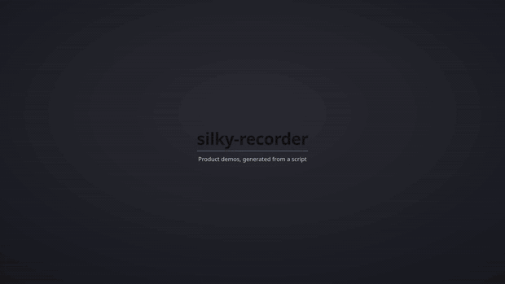

# silky-recorder

**Product demo videos, generated from a JSON file. No screen recorder, no video editor.**

You describe what to show. It opens the site in a clean headless browser, glides an animated cursor,
clicks, types, zooms into what matters, drops captions, reads them aloud in a synthesized voice,
adds click and keystroke sounds over a music bed, and writes a finished `.mp4`.

*Читать по-русски: [docs/i18n/README.ru.md](docs/i18n/README.ru.md) - подробное пошаговое руководство.*



*The GIF above was produced by silky-recorder itself, from [`scenarios/wikipedia-en.json`](scenarios/wikipedia-en.json).*

---

## Why this exists

Product demos rot. You ship a redesign, and every tutorial video you own is suddenly wrong.
Re-recording them means booting a screen recorder, doing a flawless take, and editing - for each one,
every release. So teams quietly stop updating them.

silky-recorder makes a demo an artifact of your repository instead of a one-off performance:

- **The scenario is a text file.** It lives in git, gets reviewed in pull requests, and diffs like code.
- **Re-recording is one command.** UI changed? Run it again. No take, no edit, no timeline.
- **It runs headless.** Recording happens in the background - keep using your machine.
- **It runs in CI.** Regenerate every demo on release and never ship a stale one again - see [Running in CI](#running-in-ci).

---

## Install

Requires Node.js 18+.

```bash
git clone https://github.com/harlamenko/silky-recorder
cd silky-recorder
npm install          # also fetches a Chromium build, ~1-3 min, first time only
```

## Record the bundled example

```bash
npm run record scenarios/wikipedia-en.json
```

You get `out/demo-en.mp4`. That is the whole loop.

---

## What a scenario looks like

Two parts: `meta` for global settings, `steps` for what happens, in order.

```json
{
  "meta": {
    "title": "How to find an article",
    "url": "https://en.wikipedia.org/wiki/Main_Page",
    "auth": { "type": "none" },
    "out": "out/demo.mp4"
  },
  "steps": [
    { "type": "title",   "text": "How to find an article", "hold": 2500 },
    { "type": "caption", "text": "Type your query", "read": 2500 },
    { "type": "click",   "target": "input[name=\"search\"]" },
    { "type": "type",    "target": "input[name=\"search\"]", "text": "Cat" },
    { "type": "key",     "key": "Enter" },
    { "type": "zoom",    "target": "h1", "scale": 1.4, "hold": 2500 },
    { "type": "outro",   "text": "Done" }
  ]
}
```

### Steps

| Step | Parameters | What it does |
|---|---|---|
| `title` / `outro` | `text, sub, hold` | Full-screen title card at the start / end |
| `caption` | `text, read` | Bottom toast, held for `read` ms, then slides away |
| `move` | `target, dur` | Glides the cursor to an element |
| `click` | `target, move` | Cursor to element, then click, with click sound |
| `type` | `target, text, cps` | Types into a field with keystroke sounds; `cps` = characters per second |
| `key` | `key` | Presses a key, e.g. `Enter` to submit |
| `zoom` | `target, scale, hold` | Zooms the camera to an element, holds, returns |
| `scroll` | `target` | Smooth-scrolls an element into view |
| `hover` | `target, zoom, hold` | Hovers an element, optionally zoomed |
| `say` | `text, hold` | A narrator line with nothing on screen |
| `wait` | `ms` | Explicit pause |

### Targeting elements

Two ways, use whichever is clearer:

```json
{ "target": "button.save" }              // CSS selector
{ "target": { "text": "Save" } }         // by visible text
{ "target": { "css": "h2", "index": 1 } } // nth match
```

Full reference: [`scenarios/FORMAT.md`](scenarios/FORMAT.md).

---

## Narration

Add one line to `meta` and the video narrates itself - caption, title and outro text is read aloud,
and the music ducks under the voice and comes back after:

```json
"voice": { "name": "en-US-AriaNeural" }
```

Nothing extra to install; the synthesizer ships with `npm install`. List the available voices with
`silky voices en-US`.

Captions are short, speech is not. The `say` field decouples the two:

```json
{ "type": "caption", "text": "Open the article", "read": 2000,
  "say": "Press Enter to open the article." }
```

- `"say": "..."` - read this instead of what is on screen.
- `"say": false` - stay silent on this step.
- `say` works on any step, so you can narrate a click or a scroll too.

Because every line is synthesized before the browser opens, its exact duration is known up front:
`read` and `hold` become *minimums*, and a caption never slides away mid-sentence. Each line is
synthesized once and cached in `voice/`, so re-recording the same scenario needs no network.

A fully narrated example lives in [`scenarios/wikipedia.json`](scenarios/wikipedia.json).

---

## Recording apps that need a login

Four auth strategies, set in `meta.auth`:

| Strategy | Use when |
|---|---|
| `{ "type": "none" }` | Public site |
| `{ "type": "state", "file": "auth/state.json" }` | Log in once via `silky login`, session is reused |
| `{ "type": "token", "key": "authToken", "env": "AUTH_TOKEN" }` | Auth token in localStorage - good for CI |
| `{ "type": "cdp", "endpoint": "http://127.0.0.1:9222" }` | Attach to a Chrome you already have open |

The `token` strategy is what makes unattended CI runs practical: no interactive login, no stored
cookies to expire.

You can also hide noisy elements from the recording entirely:

```json
"hide": ["app-monitoring-widget", ".cookie-banner"]
```

---

## Running in CI

The point is that the videos rebuild themselves - on every release tag, say - so a demo physically
cannot fall behind the UI.

That needs a login with no human in it, which means `auth.type: "token"`: the token lives in a
repository secret and arrives as an environment variable. The `state` strategy will not do here,
since it starts with someone logging in through a real browser window.

```yaml
name: demo
on:
  push:
    tags: ['v*']
  workflow_dispatch:

jobs:
  record:
    runs-on: ubuntu-latest
    steps:
      - uses: actions/checkout@v4
      - uses: actions/setup-node@v4
        with: { node-version: 20, cache: npm }

      - run: npm ci
      - run: npx playwright install --with-deps chromium   # system libraries for the browser

      - uses: actions/cache@v4          # narration cache: do not re-synthesize the same lines
        with:
          path: voice
          key: voice-${{ hashFiles('scenarios/*.json') }}

      - run: node bin/silky.mjs record scenarios/my.json
        env:
          AUTH_TOKEN: ${{ secrets.DEMO_AUTH_TOKEN }}

      - uses: actions/upload-artifact@v4
        with:
          name: demo
          path: out/*.mp4
```

Worth knowing up front:

- **No ffmpeg to install** - it ships with `npm install` as `ffmpeg-static`.
- **Narration needs network** at record time. The `voice/` cache removes most of the calls, but a
  line you have never synthesized before still goes out to the service.
- **There is no GPU in a runner**, so rasterization is software and recording runs noticeably slower
  than on your laptop. Budget for it on long scenarios and raise the job timeout.
- **The result lands in `out/`**, which is gitignored - collect it as a build artifact, as above.
- **Non-Latin captions need fonts** in the runner image. `ubuntu-latest` renders Cyrillic fine; bare
  containers may need fonts installed.

---

## Writing scenarios with an AI agent

Scenarios are plain JSON against a documented schema, which makes them an easy target for a coding
agent. Point one at `scenarios/FORMAT.md` and your app, describe the flow in prose, and let it emit
the file. Review the diff like any other code.

The repo ships a Claude Code skill for exactly this - `.claude/skills/scenario-author/SKILL.md`.
It explores your app through Playwright, picks stable selectors, and writes the scenario for you.

---

## How it works

1. Every narration line is synthesized and cached before the browser starts, so speech durations are
   known in advance and the step timings are laid out around them.
2. Playwright drives a clean, isolated Chromium - no extensions, no profile artifacts, nothing that
   would leak into the frame. Frames are pulled through the DevTools screencast with exact
   timestamps, which is what keeps the result smooth at 60 fps; Playwright's built-in recorder caps
   out around 25 fps and drops frames on longer takes.
3. The cursor, zoom camera, captions and title cards are rendered as an overlay inside the page, so
   there is no compositing step and no dependency on the host window manager. The overlay re-injects
   itself on navigation.
4. ffmpeg assembles the frames into an even 60 fps track (`meta.fps` to change it), mixes in the
   voice, music and click/keystroke sounds at the exact action timings, and writes the `.mp4`.

Three runtime dependencies, all self-contained: `playwright`, `ffmpeg-static` and `node-edge-tts`.
Runs on macOS, Windows and Linux.

---

## Swapping the sound

Point `meta.music` and `meta.sfx` at your own files:

```json
"music": { "file": "assets/my-track.mp3", "vol": 0.8 },
"sfx":   { "click": "assets/click.wav", "key": "assets/key.wav" }
```

See [`assets/NOTICE.md`](assets/NOTICE.md) for the provenance of the bundled defaults, and replace
them if you plan wide public distribution.

---

## CLI

```
silky record <scenario.json>   record the video
              --headed         show the browser instead of running headless
              -v, --verbose    print each step
silky login  <scenario.json>   log in once and save the session
silky voices [locale]          list narration voices, e.g. silky voices en-US
```

---

## License

Code is MIT (`LICENSE`). Bundled media in `assets/` - see [`assets/NOTICE.md`](assets/NOTICE.md).
